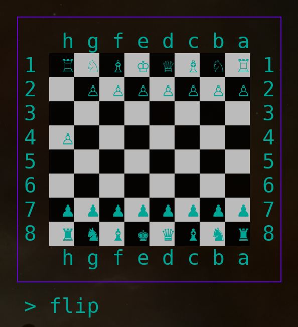

# gochess

## Demo

<p align="center">
  
</p>

The board can be flipped with the flip command.

<p align="center">
  
</p>

## Features

List of features

  - features.
    - [X] have a console to type commands in, ie `7a5a` to move local piece from field 7a to field 5a.
    - [X] implement CLI background color checkered board in black and white.
    - [X] implement CLI foreground colors for pieces (in black and white).
    - [X] add capability to insert new pieces by the user.
    - [X] implement some sort of command to insert a new piece.
    - [X] flip the sides of the board option.

## Tasks

List of things to do

  - next.
    - [ ] action history (undo, redo).
  - style.
    - [ ] allow to set the color of pieces with CLI flags.
    - [ ] have a flag for **textual** mode: RNBQKBNR pppppppp
    - [ ] have a flag for **graphical** mode: RNBQKBNR pppppppp
    - [ ] save and load games.

List of ideas

  - misc.
    - [ ] implement timer.
    - [ ] implement piece value display.
    - [ ] implement simple computer player (ie AI enemy).
    - [ ] option to customize background colors.
    - [ ] option to customize foreground colors.
    - [ ] allow new pieces, like the duck (moves everywhere, cannot be beat, blocks all attacks, is moved by both players, duck does not move, if move opens a new attack on the enemy player).
    - [ ] allow randomized starting positions.
    - [ ] allow randomized piece values (white and black adding up to the same total).
    - [ ] allow randomized piece values (white and black adding up to differing totals).
  - check for moves to be legal.
    - [ ] have a flag for **manual** mode: all moves allowed.
    - [ ] have a flag for **turns** mode: moves must follow turns.
    - [ ] have a flag for **checked** mode: all moves must be legal.
    - [ ] have a option for turning off **castling** mode: disallow castling at all.
    - [ ] have a option for turning on **attacked** mode: sallow castling through attacked squares.
    - [ ] have a option for turning off **en-passant** mode: disallow en-passants.
    - [ ] have a option for turning off **undos** mode: disallow undos.
  - add some sort off golang chess engine to deal with all the game logic.
    - [ ] for example: https://github.com/corentings/chess
    - [ ] for example: https://github.com/fdomig/gochess
    - [ ] for example: https://github.com/alvaronaschez/simple-chess

## Installation

Install the program:

```bash
go install github.com/kraasch/gochess@latest
```

Get the package:

```bash
go get github.com/kraasch/gochess
```

## Usage

Use the program:

```bash
make build
./build/gochess --help
```

Use the package:

```go
import (
  "fmt"
  "github.com/kraasch/gochess"
)

cb := gochess.NewBoard()
cb.Insert("pa6")
cb.Insert("Qa7")
cb.Insert("rh1")
cb.Move("a7a6")
cb.Insert("b8")
out := cb.Display("entire", "pieces")
fmt.Printf("%s", out)
```
The above code results in the following CLI printout.

<p align="center">
  
</p>

## Feedback

I can be reached via [alex@kraasch.eu](mailto:alex@kraasch.eu).

## Contributing

Feel free to help me.

## Acknowledgments

Uses the following software:

  - see [go.mod](./go.mod) and [go.sum](./go.sum).

Made by the following people:

  - see Github info.

## License

View the [license file](./LICENSE).

